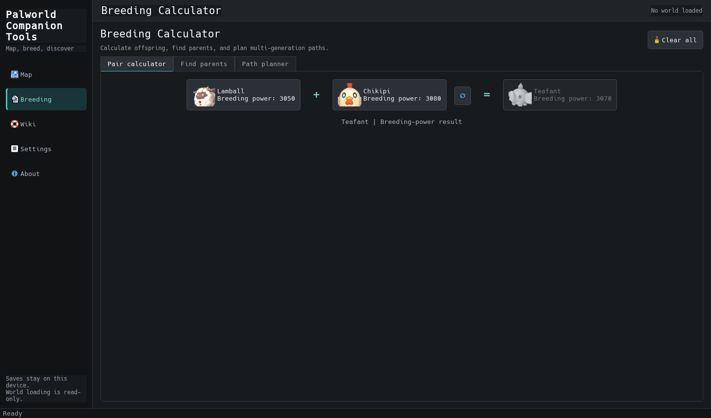
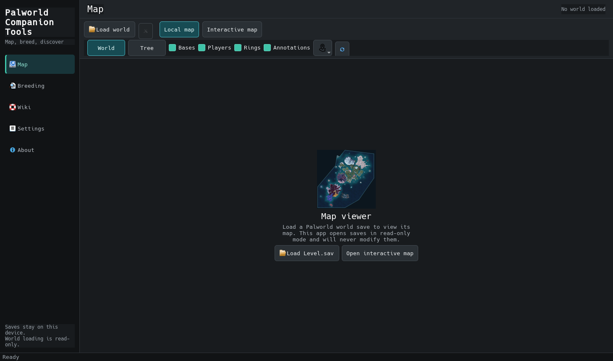
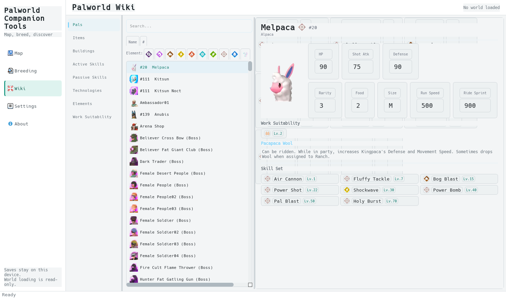

<div align="center">

<h1>Palworld Companion Tools</h1>

<p><strong>Map. Breed. Discover.</strong></p>

<p>A focused, read-only desktop companion for Palworld.</p>

[](https://github.com/rckieee-gif/Palworld-Companion-Tool/actions/workflows/ci.yml)
[](https://github.com/rckieee-gif/Palworld-Companion-Tool/releases/latest)
[](#read-only-guarantee)
[](https://www.python.org/)
[](https://doc.qt.io/qtforpython-6/)
[](license)

[Releases](https://github.com/rckieee-gif/Palworld-Companion-Tool/releases) |
[Report a bug](https://github.com/rckieee-gif/Palworld-Companion-Tool/issues/new?template=bug_report.yml) |
[Request a feature](https://github.com/rckieee-gif/Palworld-Companion-Tool/issues/new?template=feature_request.yml)

</div>



## Overview

Palworld Companion Tools keeps the informational parts of PalworldSaveTools and
removes its save-editing and server-administration capabilities. It is designed
for players who want to explore a world map, plan breeding combinations, and
browse bundled game information without modifying game data.

The application starts without a save. Breeding and Wiki are always available,
and loading `Level.sav` is optional.

### Highlights

| Feature | What it provides |
| --- | --- |
| Interactive Map | World and Tree maps, read-only base/player markers, filters, overlays, coordinates, local annotations, and MapGenie access. |
| Breeding Calculator | Parent-to-child results, desired-child searches, special combinations, required Pals, and multi-generation paths. |
| Built-in Wiki | Searchable Pals, items, buildings, technologies, skills, elements, and work suitability from bundled data. |
| Game-data validation | Verifies bundled JSON schemas, breeding references, icons, versions, and SHA-256 manifest entries locally. |
| Read-only design | No save, overwrite, patch, restore, injection, conversion, cleanup, or backup operation exists in the retained application. |
| Local processing | Save parsing, breeding searches, and Wiki browsing happen on the device. |
| Release notifications | Optional daily checks notify you when a newer stable GitHub release is available. |

## Contents

- [Features](#features)
- [Screenshots](#screenshots)
- [Read-only guarantee](#read-only-guarantee)
- [Game-data integrity](#game-data-integrity)
- [Installation](#installation)
- [Updates](#updates)
- [Quick start](#quick-start)
- [Save locations](#save-locations)
- [Build from source](#build-from-source)
- [Testing](#testing)
- [Privacy](#privacy)
- [Limitations](#limitations)
- [Contributing](#contributing)
- [Attribution and license](#attribution-and-license)

## Features

### Interactive Map Viewer

- Opens `Level.sav` as immutable input for map inspection.
- Shows World Map and Tree Map views with zooming and panning.
- Displays base and last-known player markers when available.
- Filters markers by guild or player and opens read-only detail panels.
- Toggles bases, players, radius rings, and local annotations.
- Copies coordinates and identifiers without changing world data.
- Opens the Palpagos Islands MapGenie map in an embedded or external browser.

### Breeding Calculator

- Calculates offspring from two selected parents.
- Finds parent combinations for a desired child.
- Supports normal breeding-power rules and special combinations.
- Plans a path from a starting Pal to a target Pal.
- Accepts required Pals and optional unowned breeding partners.
- Uses localized names, Pal icons, sorting, filtering, and clear states.
- Works without loading a save.

### Built-in Wiki

- Searches Pals, items, buildings, technologies, and skills.
- Shows Pal stats, elements, work suitability, learned skills, and descriptions.
- Uses bundled game data and local assets.
- Handles missing assets without crashing.
- Works without loading a save.

## Game-Data Integrity

The bundled data includes a deterministic `resources/game_data/manifest.json`.
It records the game-data version, each JSON file's SHA-256 and record counts,
the complete icon-bundle digest, known fallback icons, and unavailable Pals.

- Use **Settings > Game data > Validate data** to run the check locally.
- Validation never opens a save, changes game data, or requires a network connection.
- Unknown breeding references, version drift, missing required files, changed
  checksums, and unrecorded icon gaps are validation errors.
- Known internal/development entries without dedicated icons are reported as a
  warning and use the existing unknown-icon fallback.
- Pull-request and release workflows run the same validator before packaging.

## Screenshots

| Read-only Map Viewer | Built-in Wiki |
| --- | --- |
|  |  |

## Read-Only Guarantee

Palworld saves are immutable inputs to this application.

- The UI receives frozen marker records rather than writable world objects.
- The application imports only the decoder interface needed for inspection.
- No retained application service or UI action serializes a `.sav` file.
- Input bytes, size, SHA-256, and modification time are checked around loading.
- A load is rejected if the world changes while it is being read.
- Map annotations and preferences are stored in the app configuration directory.
- No backup is created because the application never writes to the save.

Automated tests load a fixture, navigate the map, toggle overlays, inspect
markers, close the world, and verify that every recorded file property remains
unchanged.

## Installation

### Windows release

Windows packages are published on the [latest release page](https://github.com/rckieee-gif/Palworld-Companion-Tool/releases/latest).
They contain the application and its runtime, so Python is not required.

1. Download `PalworldCompanionTools-Setup-V<version>-win-x64.exe`.
2. Run the setup program and choose whether to create a desktop shortcut.
3. Launch **Palworld Companion Tools** from the Start Menu.
4. Open Breeding or Wiki immediately, or load `Level.sav` from Map.

The setup installs for the current Windows user, does not require administrator
rights, and includes an uninstaller. Community builds are currently unsigned,
so Windows SmartScreen may ask you to confirm that you want to run them.

### Portable Windows package

For a no-install copy:

1. Download `PalworldCompanionTools-Portable-V<version>-win-x64.zip`.
2. Extract the entire ZIP to a folder.
3. Run `PalworldCompanionTools-V<version>-win.exe` inside that folder.

Use `SHA256SUMS.txt` on the release page to verify either download when desired.

The currently verified packaged platform is Windows 11. Source execution is
also supported on Linux and macOS, but native packages must be built and tested
on those operating systems.

### Run from source

Requirements:

- Python 3.11 or newer
- Git
- `pip` or [uv](https://docs.astral.sh/uv/)

```powershell
git clone https://github.com/rckieee-gif/Palworld-Companion-Tool.git
cd Palworld-Companion-Tool
python -m venv .venv
.\.venv\Scripts\python.exe -m pip install .\src\palsav\palooz
.\.venv\Scripts\python.exe -m pip install -r requirements.txt
.\.venv\Scripts\python.exe start.py
```

With `uv`:

```powershell
uv sync --group dev
uv run python start.py
```

## Updates

The app checks the repository's latest stable GitHub Release at startup at most
once every 24 hours. When a newer version is available, it displays a notice and
an **Open release** button. Installation remains user-controlled; the app never
downloads or runs an update automatically.

Automatic checks are enabled by default and can be disabled under
**Settings > Updates**. **Check now** is available in Settings and About. Update
checks send a normal HTTPS request to GitHub and never include save files,
player identifiers, map data, or Wiki searches.

## Quick Start

1. Start the application. Breeding opens by default.
2. Use Pair Calculator to select two parents and view their offspring.
3. Use Find Parents or Path Planner for a target Pal.
4. Open Wiki to search the bundled Palworld data.
5. Open Map and select **Load world** to inspect a `Level.sav` file.
6. Use the map filters, overlays, marker details, and coordinate tools.
7. Select **Close world** when finished. No game file is changed.

## Save Locations

Common `Level.sav` locations include:

```text
Windows Steam
%LOCALAPPDATA%\Pal\Saved\SaveGames\<SteamID>\<WorldID>\Level.sav

Windows dedicated server
PalServer\Pal\Saved\SaveGames\0\<WorldID>\Level.sav

Linux Steam / Proton
~/.local/share/Steam/steamapps/compatdata/1623730/pfx/drive_c/users/steamuser/
AppData/Local/Pal/Saved/SaveGames/<SteamID>/<WorldID>/Level.sav
```

The sibling `Players` folder is optional. If it is absent, the map still loads
world/base information and explains that player markers are unavailable.

## Build From Source

Create a Windows standalone distribution with Nuitka:

```powershell
.\.venv\Scripts\python.exe build\nuitka\build_nuitka.py --standalone
.\.venv\Scripts\python.exe build\verify_build.py
```

Create one executable file:

```powershell
.\.venv\Scripts\python.exe build\nuitka\build_nuitka.py --onefile
```

To build the Windows installer, install
[Inno Setup 6](https://jrsoftware.org/isinfo.php), then run:

```powershell
.\.venv\Scripts\python.exe build\nuitka\build_nuitka.py --standalone
.\.venv\Scripts\python.exe build\verify_build.py
.\.venv\Scripts\python.exe build\installer\build_installer.py
.\.venv\Scripts\python.exe build\package_release.py
```

The GitHub release workflow runs tests, builds one standalone distribution,
creates the per-user installer and portable ZIP, writes SHA-256 checksums, and
attaches all three artifacts to releases triggered by matching `v*` tags.

## Testing

```powershell
.\.venv\Scripts\python.exe -m pytest -q
.\.venv\Scripts\python.exe scripts\validate_game_data.py
```

The suite covers startup, the five allowed navigation entries, feature-removal
boundaries, file invariants, map interactions, breeding formulas, special
combinations, path constraints, Wiki categories, localization, resources, and
packaging configuration.

After intentionally updating files under `resources/game_data`, regenerate and
review the manifest before running validation:

```powershell
.\.venv\Scripts\python.exe scripts\generate_game_data_manifest.py
.\.venv\Scripts\python.exe scripts\validate_game_data.py
```

## Privacy

- Save parsing is local.
- Breeding and Wiki searches are local.
- Save data, player identifiers, and world data are not uploaded.
- Preferences and local annotations are stored in the app configuration folder.
- Optional update checks contact only GitHub's latest-release API and send no save data.
- MapGenie is an optional third-party website and requires network access.

## Limitations

- Palworld save formats and game data can change after game updates.
- The validation manifest proves bundle consistency, not endorsement or live
  accuracy against Pocketpair's current servers.
- Save inspection focuses on the guild, base, and player locations needed by Map.
- The bundled Wiki is not an official live database.
- MapGenie availability depends on Qt WebEngine and the third-party service.
- Update notifications require internet access and track stable GitHub Releases only.
- Windows packages are not currently code-signed and may trigger SmartScreen.
- Native Linux and macOS release packages are not currently validated.

## Contributing

Contributions that improve Map, Breeding, Wiki, accessibility, localization,
testing, or read-only safety are welcome. Save editing and server-administration
features are intentionally outside this project's scope.

Read [CONTRIBUTING.md](CONTRIBUTING.md) before opening a pull request. Security
reports should follow [SECURITY.md](SECURITY.md).

## Attribution And License

This project is a streamlined derivative of
[PalworldSaveTools](https://github.com/deafdudecomputers/PalworldSaveTools). It
retains the original MIT license and attribution. The save-editing and
server-administration features have been removed.

The root [`license`](license) preserves the original MIT copyright notice:
Copyright (c) 2026 Pylar.

The vendored `palsav-flex` / `palooz` parser dependency carries its own
GPL-3.0-or-later license in [`src/palsav/LICENSE`](src/palsav/LICENSE).

Palworld and related names, trademarks, and game assets belong to Pocketpair and
their respective owners. This project is not affiliated with, endorsed by, or
sponsored by Pocketpair. MapGenie is a third-party service and is not affiliated
with this project.

<div align="center">

[Back to top](#palworld-companion-tools)

</div>
